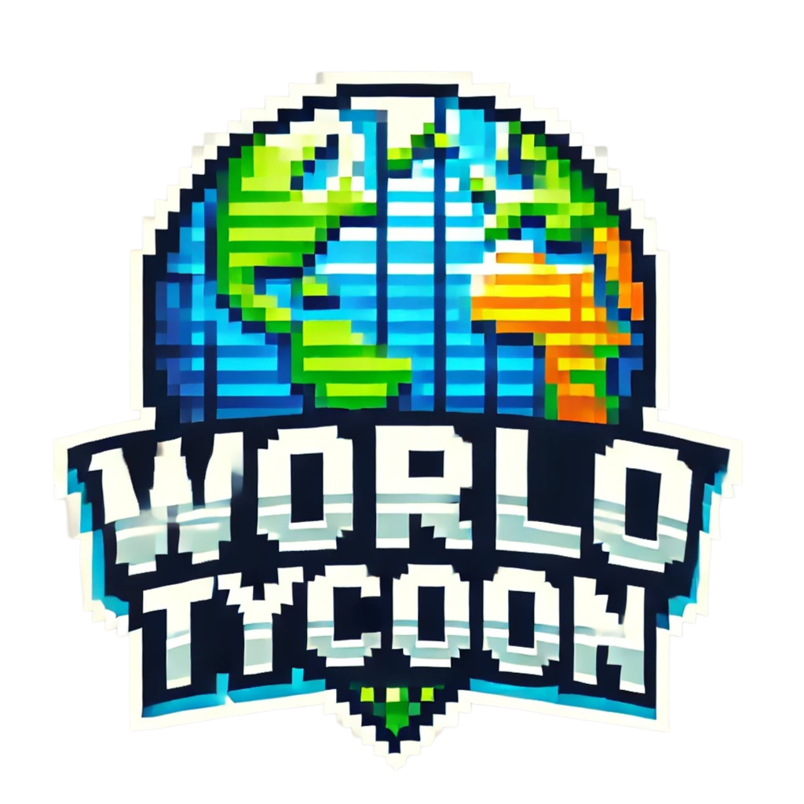
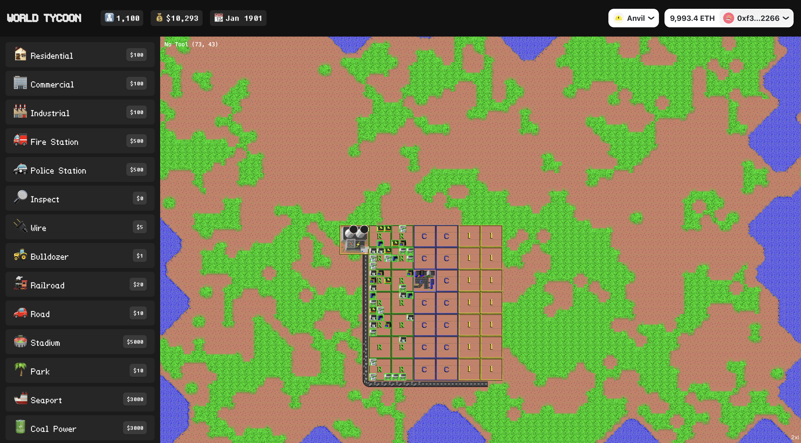

# World Tycoon
---


SimCity was launched back in 1989 developed by the legendary game designer Will Write. In 2008, the engine C code was ported to C++ and released as free software under the GPL-3.0-or-later license, renamed to Micropolis for trademark reasons.

World Tycoon uses the original city simulator that started it all in 1989 to the crypto era. Build a city using the same game engine but with real economics.


## Game Economy
---

The original game has a fairly complex simulation logic, but a quite simple economy. A game starts with a budget of say $20,000. The player then spends money to build zones, power plants, roads, and other structures. Existing infrastructure also requires resources to keep everything in good condition. Once an year the city collects taxes from the population.

The game economy is powered by a Ethereum ERC-20 token, any token, chosen by the application deployer. Preferrably a fixed supply token.

The first step to play the game is to bridge tokens from Ethereum into the L2 wallet of the game. Building a new city requires 20000 tokens. Currently a player can have only one city at a time.

When the player builds a new city, the application transfers 20000 tokens from his wallet to a special in-game wallet (0x0000000000000000000000000000000000000001), which matches the game simulations funds.

When the player make city expenses, like building new structures, or just paying for maintenance, funds are transferred from the in-game wallet to another special people wallet (0x0000000000000000000000000000000000000002). This is like the city hiring its people to do the work.

Once every "game year" taxes are collected, which now transfer funds from the people wallet to the in-game wallet.

In a nutshell, if the player does a good job he recovers the initial investment and make some profit. If the player does a bad job, he will lose money and eventually go bankrupt.

If the people wallet runs out of funds, the global economy is in trouble. The game will stop working and the player will not be able to play anymore. However the application deployer can be in control of a token supply and donate more token to the people, which can be seen as a World Bank providing humanitarian support.



### Pre-requisite
```shell
 npm i -g @cartesi/cli
```

### Run backend
```shell
cd dapp
cartesi build
cartesi run
```

### Running the web UI
The UI is a Next.js application, and can be built with the command below:

```shell
cd web
bun i
bun dev
```

### Send input to start game 
You can use the cartesi cli to send inputs manually without the web UI
```shell
cartesi send
Select send sub-command Send generic input to the application.
? Chain Foundry
? RPC URL http://127.0.0.1:8545
? Wallet Mnemonic
? Mnemonic test test test test test test test test test test test junk
? Account 0xf39Fd6e51aad88F6F4ce6aB8827279cffFb92266 9993.476291596530017783 ETH
? Application address 0xab7528bb862fb57e8a2bcd567a2e929a0be56a5e
? Input String encoding
? Input (as string) {"method" : "start", "seed" : 0}
```


